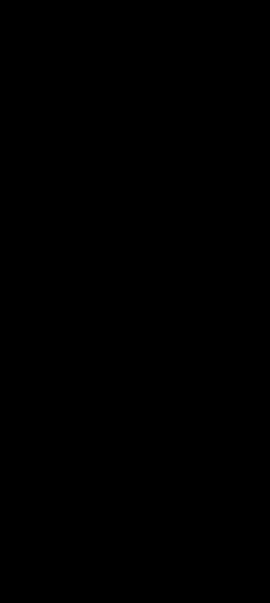

# Speedy

A minimal Android network speed monitor that shows your live upload and
download speed directly in the status bar.

Written from scratch in modern Kotlin with Jetpack Compose — no trackers,
no ads, no analytics.



## Features

- **Status-bar icon** — upload on top, download below, updated every second.
- **Drift-corrected sampling** — uses the real elapsed time between ticks, not
  an assumed 1 s, so jitter doesn't distort the reading.
- **Scaled units** — `bps → Kbps → Mbps → Gbps`, integers everywhere except
  sub-10 Gbps (1 decimal, e.g. `1.2G`).
- **Battery-aware** — pauses sampling while the screen is off; resumes
  instantly on screen-on.
- **Network-aware** — hides the icon when there's no transport (airplane
  mode / no connectivity); comes back automatically.
- **Boot-persistent** — remembers whether you had it enabled and restarts
  after reboot (waits for the first unlock; not `directBootAware`).
- **Dashboard** — Material 3, dynamic Material You colors, live speed
  mirrored from the service.
- **Privacy-first** — zero third-party SDKs. No analytics, no crash reporting.

## Tech stack

- **Language:** Kotlin 2.1
- **UI:** Jetpack Compose + Material 3
- **DI:** Dagger Hilt
- **Async:** Coroutines + StateFlow
- **Storage:** Jetpack DataStore (Preferences)
- **Build:** Gradle 8.11 + AGP 8.8 + KSP
- **Android:** `minSdk 26`, `targetSdk 35`, `compileSdk 36`

## Architecture

Three-layer split, single-module:

```
domain/   Pure Kotlin — SpeedCalculator (drift-corrected delta),
          SpeedFormatter (unit thresholds), ServiceState, SpeedSample.

data/     SettingsRepository (DataStore), SpeedStateHolder (shared @Singleton
          StateFlow — the bridge between the service and the UI).

service/  SpeedMonitorService (FOREGROUND_SERVICE_TYPE_SPECIAL_USE),
          SpeedIconRenderer (reused 96×96 ALPHA_8 Bitmap, redrawn every tick),
          NotificationFactory, BootReceiver.

ui/       MainActivity, DashboardScreen, DashboardViewModel, PermissionChecker.
```

The single `SpeedStateHolder` is what lets the Dashboard and the service
share the exact same stream of samples — the service writes, the ViewModel
reads, Hilt's `@Singleton` guarantees the identity.

## Building

```sh
git clone https://github.com/driversti/speedy.git
cd speedy
./gradlew :app:assembleDebug
```

Or open in Android Studio — `Sync Project with Gradle Files`.

> Gradle is pinned to JDK 21 via `gradle.properties`
> (`org.gradle.java.home=…/21.0.10-tem`). Remove or adjust that line to match
> your local JDK if needed — AGP 8.8 doesn't support JDK 25.

## Running the tests

```sh
./gradlew :app:testDebugUnitTest
```

Covers `SpeedFormatter` thresholds/rounding and `SpeedCalculator`
first-tick / overflow / drift / reset edge cases.

## Known limitations

- **Status bar placement:** the icon lives in the left-side notification
  area, not next to wifi/battery. Those slots are System UI territory and
  no public Android API allows third-party apps to place icons there.
- **Notification shown at all:** requires `POST_NOTIFICATIONS` on
  Android 13+ and the channel importance to be at least Low. The Dashboard
  guides you through both.
- **Bitmap size bumped:** the original spec asked for 48×48 ALPHA_8. On
  high-density Pixel devices the system resizer drops it rather than
  upscaling — `SpeedIconRenderer` uses 96×96 instead so the icon actually
  renders.

## License

Licensed under the [Apache License, Version 2.0](LICENSE). © 2026 Yurii Chekhotskyi.
